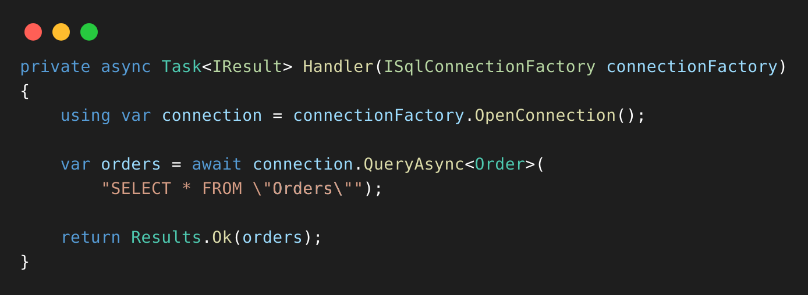
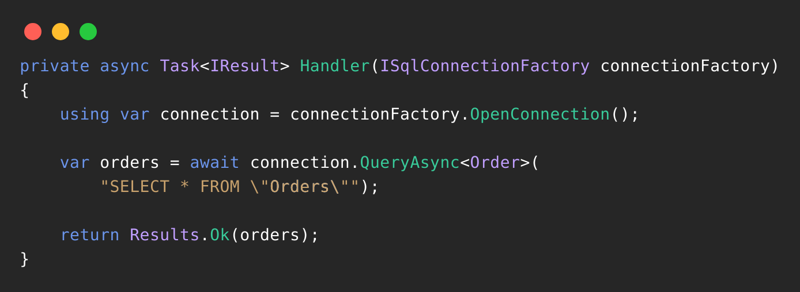
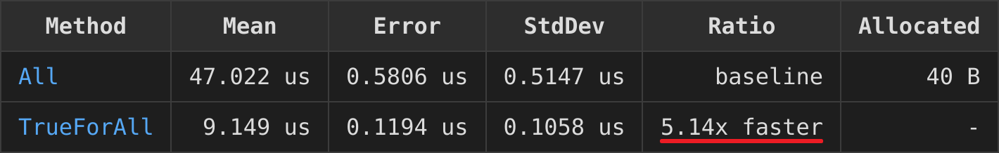

# Code Snippet Generator

A system for generating syntax-highlighted code snippets as images, using a dual-service architecture:

- **Generator Service**: A Python service that tokenizes code and prepares HTML
- **Renderer Service**: A Node.js service using Puppeteer to convert HTML to images

## Example Output

Here's an example of how the generator creates syntax-highlighted images from C# code:

```csharp
private async Task<IResult> Handler(ISqlConnectionFactory connectionFactory)
{
    using var connection = connectionFactory.OpenConnection();

    var orders = await connection.QueryAsync<Order>(
        "SELECT * FROM \"Orders\"");

    return Results.Ok(orders);
}
```

The code above generates different outputs depending on the IDE theme:

### Visual Studio Theme


### Rider Theme


## Benchmark Table Image Generation

The generator can also create images from .NET benchmark result tables (such as those produced by BenchmarkDotNet). For example, given a benchmark table in plain text:

| Method     | Mean      | Error     | StdDev    | Ratio        | RatioSD | Allocated | Alloc Ratio |
|----------- |----------:|----------:|----------:|-------------:|--------:|----------:|------------:|
| All        | 47.022 us | 0.5806 us | 0.5147 us |     baseline |         |      40 B |             |
| TrueForAll |  9.149 us | 0.1194 us | 0.1058 us | 5.14x faster |   0.08x |         - |          NA |

The generator will produce an image of the formatted benchmark table, like this:



When working with benchmark tables, the UI allows you to customize the output image:
- **Column Selection**: You can choose which columns from the benchmark table to include in the generated image, so only the data you care about is shown.
- **Cell Underlining**: The UI also lets you underline any specific cell(s) in the table, making it easy to highlight important results or comparisons directly in the image.

## Setup

### Environment Configuration

1. Create a `.env` file in `generator-service/src` with:
```
# Path configurations
BLOG_POSTS_PATH=/path/to/your/blog/posts
OUTPUT_PATH=/path/to/your/output
LINKEDIN_POSTS_PATH=/path/to/your/linkedin/posts
LINKEDIN_BLOG_POSTS_PATH=/path/to/your/linkedin/blog/posts

# Renderer service configuration
RENDERER_SERVICE_URL=http://localhost:3000

# Output directory for generated images
OUTPUT_DIR=/path/to/output/directory
```

### Deployment Options

#### Hybrid Setup (Recommended)

For best experience with the CLI interface:

1. **Run Renderer in Docker**:
```bash
docker-compose -f docker-compose.renderer.yml up -d
```

2. **Run Generator locally**:
```bash
cd generator-service
pip install -r requirements.txt
python src/main.py
```

#### Full Docker Setup

Run both services in Docker (note: CLI interaction will be limited):

```bash
docker-compose up -d
```

#### Fully Local Setup

1. **Renderer Service**:
```bash
cd renderer-service
npm install
node server.js
```

2. **Generator Service**:
```bash
cd generator-service
pip install -r requirements.txt
python src/main.py
```

## Usage

The application offers two main interfaces:

1. **CLI Menu** - Run the generator service locally to access:
   - Blog Generator: Process blog posts with code snippets
   - Image Generator: Create individual code snippet images

2. **API Integration** - For programmatic use:
```python
from generators.html_generator import HtmlGenerator

# Generate an image from code and its token classifications
HtmlGenerator.render_code_snippet_image(
    code_snippet, 
    token_classifications,
    dest_path="output_folder",
    filename="snippet.png"
)
```

## System Architecture

- The **Generator Service** processes and tokenizes code, generating HTML with proper syntax highlighting
- The **Renderer Service** receives HTML via REST API endpoints, renders it using Puppeteer, and saves the result as a transparent PNG
- Both services share an output directory through Docker volumes
